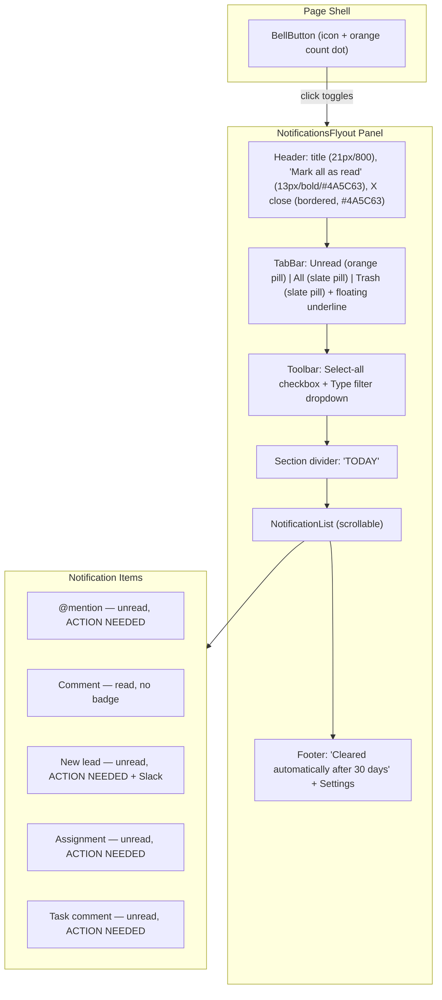

# Notifications Flyout — Problem Discovery

## Goal

Rebuild the Enso Homes Notifications flyout (the panel that opens from the bell icon, top right) as production React, matching it as closely as possible: spacing, density, states, and overall fidelity to the original design screenshots.

## Anatomy



### Key visual observations

| Area | Detail |
|---|---|
| Panel | White bg, 420px wide, right-aligned, border-l + shadow, full viewport height, slides in from right (250ms ease-out) |
| Header | "Notifications" 21px font-weight 800, "Mark all as read" 13px bold #4A5C63, X in 28px bordered square #4A5C63 |
| Tabs | Three text tabs; active tab has floating underline (#4A5C63) with space above and below; count pills: orange for Unread, #77858B solid for active non-unread, #77858B/15 for inactive |
| Toolbar | Checkbox "Select all" left, "Type: All" dropdown right |
| Section label | "TODAY" uppercase 11px muted, top border |
| Notification item | Checkbox, icon (rounded-lg square), title (13px) + timestamp, description (12px, right-padded to avoid trash icon), optional badges. Hover: trash icon appears right-centered. Unread: orange-50 bg. Checked: neutral-100 bg. |
| Icon types | AtSign (orange), MessageCircle (gray), UserPlus (orange), User (gray/orange), SquareCheckBig (gray), Calendar (gray) — in rounded-lg square backdrops (orange/gray/green) |
| ACTION NEEDED badge | 9.5px, AlertTriangle size 11, text-orange-600 |
| Slack badge | 9.5px, bg-purple-100, text-purple-700 |
| Checkbox | Unchecked: 18px, rounded, border-2 neutral-300. Checked: bg-neutral-400, white Check icon (size 13, strokeWidth 2.5) |
| Footer | "Cleared automatically after 30 days" muted, Settings link with gear icon |
| Bell button | 40px circle, white bg, border, Bell icon. Orange dot with count when unread > 0 |

## Assumptions & Confirmations

| # | Assumption | Status | Evidence |
|---|---|---|---|
| A1 | Standalone client component, mock data only | Confirmed | Scope note: no real filtering/logic |
| A2 | lucide-react needed for icons | Confirmed | No icon lib was installed; now added |
| A3 | Panel width ~420px, right-aligned, full height | Confirmed | Proportions from screenshot |
| A4 | Active tab: bold text + floating underline + colored pill | Confirmed | Verified through experiments |
| A5 | Consistent notification item layout: checkbox, icon-square, content, timestamp | Confirmed | Both screenshots |
| A6 | Existing Badge component reusable for variants | Confirmed | components/ui/badge.tsx |
| A7 | Geist font loaded in layout.tsx | Confirmed | app/layout.tsx |
| A8 | Tailwind v4 with @theme inline, no config file | Confirmed | app/globals.css |
| A9 | Bell button is simple icon + dot overlay | Confirmed | Screenshot top-right |
| A10 | No backdrop overlay / dimming | Confirmed | Invisible click-away div, no visual overlay |

## 5 Majors

1. **Icon fidelity with lucide-react** — Can we match the Enso icon style with lucide glyphs in colored rounded-square backdrops?
2. **Spacing and density at 420px with Geist** — Does the layout feel right with the chosen font sizes, padding, and gaps?
3. **Color matching** — Do Tailwind default oranges/purples/grays match the Enso brand colors closely enough?
4. **Slide animation** — Does a CSS translateX transition feel right for the flyout open/close?
5. **Checkbox styling** — Can we achieve gray bg + white checkmark with a custom component?

## Experiments

### Experiment 1 — Icon Fidelity

**Hypothesis:** lucide-react provides close-enough glyphs. Wrapping each in a colored rounded-lg div will approximate Enso icons.

**Method:** Rendered all icon types in colored square backdrops side-by-side on a test page.

**Result:** Confirmed after 4 rounds of iteration:
- `MessageSquare` swapped to `MessageCircle` (round bubble)
- `Users` swapped to `User` (single person) + `UserPlus` (person + plus)
- `ClipboardList` swapped to `SquareCheckBig` (checkbox glyph)
- `Calendar` added
- `ArrowUpRight` removed (not used in notifications)
- Backdrops changed from `rounded-full` to `rounded-lg` (rounded squares)
- Three color variants confirmed: orange, gray, green

### Experiment 2 — Spacing & Density

**Hypothesis:** 420px wide panel with 14px body text, 12px metadata, and the confirmed padding values would match Enso density.

**Method:** Built full static flyout skeleton with header, tabs, toolbar, 5 notification items, and footer.

**Result:** Confirmed after tuning:
- Title: 21px, font-weight 800
- "Mark all as read": 13px, bold, #4A5C63
- Close button: 28px square, bordered, #4A5C63 icon
- Tab underline: floating absolute element with #4A5C63, space above and below
- Tab pills: orange for Unread, #77858B for active non-unread, #77858B/15 for inactive
- Header bottom padding: 14px
- Tab bar: floating underline approach with inner padding div

### Experiment 3 — Color Matching

**Hypothesis:** Tailwind defaults would need adjustment to match Enso brand.

**Method:** Visual comparison of rendered colors against screenshots.

**Result:** Tailwind defaults accepted as close enough. Only adjustment: ACTION NEEDED and Slack badges reduced from `text-xs` (12px) to `text-[9.5px]` with icon size 11.

### Experiment 4 — Slide Animation

**Hypothesis:** CSS transition on `translateX(100%) -> translateX(0)` at 250ms ease-out would feel right.

**Method:** Added useState toggle with bell button, applied transition-transform classes.

**Result:** Confirmed. 250ms ease-out translateX transition with bell button toggle and invisible backdrop dismiss.

### Experiment 5 — Checkbox Styling

**Hypothesis:** Custom div-based checkbox can achieve gray bg + white checkmark.

**Method:** Already built into the flyout. Checkbox component renders empty border when unchecked, bg-neutral-400 + white Check icon when checked.

**Result:** Confirmed. 18px rounded, border-2 neutral-300 unchecked, bg-neutral-400 + Check size 13 strokeWidth 2.5 white when checked.

## Root Cause

No notifications flyout component existed. The page was an empty shell. The entire component needed to be built from scratch matching the Enso design.

## Solution Proposal

Refactored the experiment prototype into production components:

### File structure

```
components/notifications/
  types.ts              — NotifIconType, NotifBadge, IconVariant, Notification, Tab, TabId, TABS, MOCK_NOTIFICATIONS
  Checkbox.tsx          — Custom checkbox (gray bg + white check), aria role, onChange callback
  NotifIcon.tsx         — Icon-in-rounded-square with type-to-lucide mapping and variant color mapping
  NotificationItem.tsx  — Single row: checkbox, icon, content (title 13px + description 12px + badges 9.5px), timestamp, hover trash icon. Unread: bg-orange-50, checked: bg-neutral-100, hover: trash icon appears
  BellButton.tsx        — Bell icon in 40px circle with orange count dot
  NotificationsFlyout.tsx — Full panel: header, tabs (with floating underline + useState<TabId>), toolbar, section label, scrollable notification list (with checkbox toggling via Set<string>), footer
app/
  page.tsx              — Composes BellButton + invisible backdrop + NotificationsFlyout with open/close state
```

### Style tokens

| Token | Value |
|---|---|
| Panel width | 420px |
| Dark slate | #4A5C63 |
| Slate | #77858B |
| Title | 21px, weight 800 |
| "Mark all as read" | 13px, weight 700, #4A5C63 |
| Notification title | 13px |
| Notification description | 12px (text-xs) |
| Badge font | 9.5px |
| Close button | 28px square, border neutral-300, icon #4A5C63 |
| Animation | transition-transform duration-250 ease-out |
| Checkbox | 18px, rounded, border-2 neutral-300 / bg-neutral-400 + white Check |
| Icon square | 36px (w-9 h-9), rounded-lg |

### Scope exclusions

- Snooze bar (belongs to inbox, not notifications — confirmed with user)
- Real tab filtering logic
- Real data fetching
- Snooze scheduling logic
